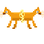
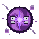

# BugMon

A monster-taming RPG where the monsters are software bugs. Catch them all, if your code can handle it.

**[Play Now](https://jpleva91.github.io/BugMon/)**

<p align="center">
  
  
  
  
  
  
  
  
</p>

## How to Play

Walk through the world and step into tall grass to encounter wild BugMon. Battle them, weaken them, and capture them for your party.

### Controls

| Action | Keyboard | Mobile |
|--------|----------|--------|
| Move | Arrow keys | D-pad |
| Confirm / Select | Enter | A button |
| Back / Cancel | Escape | B button |

### Battle

When you encounter a wild BugMon, you have three options:

- **Fight** -- Pick a move to attack. Faster BugMon acts first.
- **Capture** -- Try to catch it. Lower HP = higher chance. A failed capture gives the enemy a free turn.
- **Run** -- Always succeeds.

Your BugMon auto-heals when it faints, so you can keep exploring.

## Type System

Each BugMon and move has a type. Type matchups affect damage:

| | vs Memory | vs Logic | vs Runtime | vs Syntax |
|---|:-:|:-:|:-:|:-:|
| **Memory** | 1x | 0.5x | **1.5x** | 1x |
| **Logic** | 1x | 1x | 0.5x | **1.5x** |
| **Runtime** | 0.5x | **1.5x** | 1x | 1x |
| **Syntax** | **1.5x** | 1x | 1x | 0.5x |

## BugMon Roster

| Sprite | Name | Type | HP | ATK | DEF | SPD | Moves |
|--------|------|------|---:|----:|----:|----:|-------|
|  | **NullPointer** | Memory | 30 | 8 | 4 | 6 | SegFault, Hotfix |
|  | **RaceCondition** | Logic | 25 | 6 | 3 | 10 | ThreadLock, Hotfix |
|  | **MemoryLeak** | Memory | 40 | 5 | 6 | 3 | GarbageCollect, MemoryDump |
|  | **Deadlock** | Logic | 35 | 7 | 8 | 2 | Mutex, ForceQuit |
|  | **OffByOne** | Logic | 28 | 7 | 5 | 7 | NullCheck, Rollback |
|  | **MergeConflict** | Syntax | 32 | 6 | 7 | 4 | Refactor, PatchDeploy |
|  | **CallbackHell** | Runtime | 27 | 9 | 3 | 8 | HotReload, BlueScreen |
|  | **Heisenbug** | Logic | 26 | 7 | 4 | 9 | NullCheck, TypeMismatch |
|  | **InfiniteLoop** | Runtime | 45 | 4 | 5 | 1 | CoreDump, HotReload |
|  | **SpaghettiCode** | Syntax | 33 | 8 | 5 | 3 | Refactor, Compile |
|  | **StackOverflow** | Runtime | 30 | 9 | 4 | 6 | BufferOverrun, BlueScreen |
|  | **IndexOutOfBounds** | Memory | 28 | 8 | 3 | 8 | BufferOverrun, SegFault |

## Features

- 12 unique BugMon to discover and capture
- Type system (Memory, Logic, Runtime, Syntax) with effectiveness matchups
- 17 moves across all four types
- Tile-based exploration with random encounters in tall grass
- Turn-based combat with speed priority and damage calculation
- Capture mechanic with HP-based probability
- Pixel art sprites for all BugMon and player character
- Synthesized sound effects (Web Audio API, no audio files)
- Mobile touch controls with D-pad and action buttons
- Mute toggle (speaker icon, top-right corner)
- Zero dependencies -- pure vanilla JS and HTML5 Canvas

## Run Locally

```bash
git clone https://github.com/jpleva91/BugMon.git
cd BugMon
python3 -m http.server
# Open http://localhost:8000
```

Any static file server works. No build step required.

## Tech Stack

- Vanilla JavaScript (ES6 modules)
- HTML5 Canvas 2D
- Web Audio API (synthesized sounds)
- Zero dependencies, zero build tools

## Project Structure

See [ARCHITECTURE.md](ARCHITECTURE.md) for technical details and [ROADMAP.md](ROADMAP.md) for planned features.

## License

MIT
