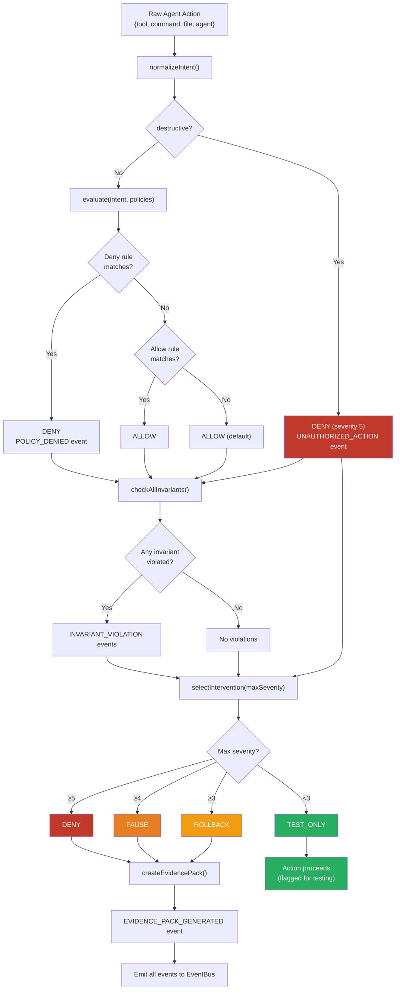

# AAB Decision Flow Diagram

## Evaluation Pipeline



## ASCII Representation

```
Raw Agent Action
  { tool: "Bash", command: "git push --force origin main" }
                    │
                    ▼
            normalizeIntent()
  ┌─────────────────────────────────────────┐
  │ 1. TOOL_ACTION_MAP["Bash"] → shell.exec │
  │ 2. detectGitAction() → git.force-push   │
  │ 3. isDestructiveCommand() → false       │
  │ 4. extractBranch() → main               │
  │                                         │
  │ Output: {                               │
  │   action: "git.force-push",             │
  │   target: "main",                       │
  │   branch: "main",                       │
  │   destructive: false                    │
  │ }                                       │
  └─────────────────┬───────────────────────┘
                    │
                    ▼
           ┌──── destructive? ────┐
           │ No                   │ Yes
           ▼                     ▼
    evaluate(intent,       DENY (severity 5)
     policies)             emit UNAUTHORIZED_ACTION
           │
    ┌──────┴──────┐
    │ Deny rules  │ ◄── checked first (fail-closed)
    │ first       │
    └──────┬──────┘
           │ match?
    ┌──────┴──────┐
    │ Yes         │ No
    ▼             ▼
  DENY         Allow rules
  emit         │ match?
  POLICY_      ├── Yes → ALLOW
  DENIED       └── No  → ALLOW (default)
           │
           ▼
    checkAllInvariants()
    ┌──────────────────────────────────┐
    │ no-secret-exposure  (sev 5) → ? │
    │ protected-branch    (sev 4) → ? │
    │ blast-radius-limit  (sev 3) → ? │
    │ test-before-push    (sev 3) → ? │
    │ no-force-push       (sev 4) → ✗ │
    │ lockfile-integrity  (sev 2) → ? │
    └──────────────────┬───────────────┘
                       │ violations[]
                       ▼
           selectIntervention(maxSeverity)
           ┌──────────────────────┐
           │ ≥5 → DENY           │
           │ ≥4 → PAUSE          │ ◄── this case
           │ ≥3 → ROLLBACK       │
           │ <3 → TEST_ONLY      │
           └──────────┬───────────┘
                      │
                      ▼
            createEvidencePack()
            emit EVIDENCE_PACK_GENERATED
```

## Source References

- `normalizeIntent()`: `src/kernel/aab.ts`
- `isDestructiveCommand()`: `src/kernel/aab.ts`
- `detectGitAction()`: `src/kernel/aab.ts`
- `authorize()`: `src/kernel/aab.ts`
- `evaluate()`: `src/policy/evaluator.ts`
- `checkAllInvariants()`: `src/invariants/checker.ts`
- `selectIntervention()`: `src/kernel/decision.ts`
- `createEvidencePack()`: `src/kernel/evidence.ts`
