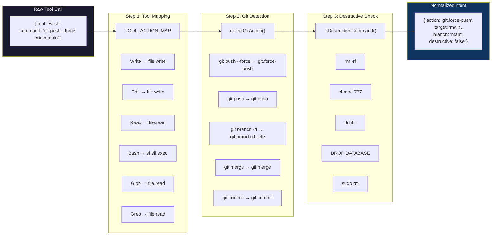

# Canonical Action Pipeline Diagram

## From Raw Tool Call to NormalizedIntent



## ASCII Representation

```
RAW TOOL CALL
┌───────────────────────────────────────────────┐
│ { tool: "Bash",                               │
│   command: "git push --force origin main",    │
│   agent: "claude" }                           │
└───────────────────────┬───────────────────────┘
                        │
                        ▼
STEP 1: TOOL_ACTION_MAP ─────────────────────────
┌───────────────────────────────────────────────┐
│  "Write" ──→ "file.write"                     │
│  "Edit"  ──→ "file.write"                     │
│  "Read"  ──→ "file.read"                      │
│  "Bash"  ──→ "shell.exec"  ◄── this case     │
│  "Glob"  ──→ "file.read"                      │
│  "Grep"  ──→ "file.read"                      │
│  unknown ──→ "unknown"                        │
└───────────────────────┬───────────────────────┘
                        │ action = "shell.exec"
                        ▼
STEP 2: detectGitAction() ───────────────────────
┌───────────────────────────────────────────────┐
│  /git\s+push\s+--force/  → "git.force-push"  │ ◄── match!
│  /git\s+push/            → "git.push"         │
│  /git\s+branch\s+-[dD]/  → "git.branch.delete"│
│  /git\s+merge/           → "git.merge"        │
│  /git\s+commit/          → "git.commit"       │
│  else                    → null               │
└───────────────────────┬───────────────────────┘
                        │ action = "git.force-push"
                        │ branch = "main" (via extractBranch)
                        ▼
STEP 3: isDestructiveCommand() ──────────────────
┌───────────────────────────────────────────────┐
│  /rm\s+-rf/              no match             │
│  /chmod\s+777/           no match             │
│  /dd\s+if=/              no match             │
│  /mkfs/                  no match             │
│  /sudo\s+rm/             no match             │
│  /dropdb/                no match             │
│  /DROP\s+DATABASE/i      no match             │
│  /DROP\s+TABLE/i         no match             │
│                                               │
│  Result: destructive = false                  │
└───────────────────────┬───────────────────────┘
                        │
                        ▼
NORMALIZED INTENT ───────────────────────────────
┌───────────────────────────────────────────────┐
│ {                                             │
│   action: "git.force-push",                   │
│   target: "main",                             │
│   agent: "claude",                            │
│   branch: "main",                             │
│   command: "git push --force origin main",    │
│   destructive: false                          │
│ }                                             │
└───────────────────────────────────────────────┘
```

## Source References

- `TOOL_ACTION_MAP`: `src/kernel/aab.ts`
- `detectGitAction()`: `src/kernel/aab.ts`
- `isDestructiveCommand()`: `src/kernel/aab.ts`
- `extractBranch()`: `src/kernel/aab.ts`
- `normalizeIntent()`: `src/kernel/aab.ts`
