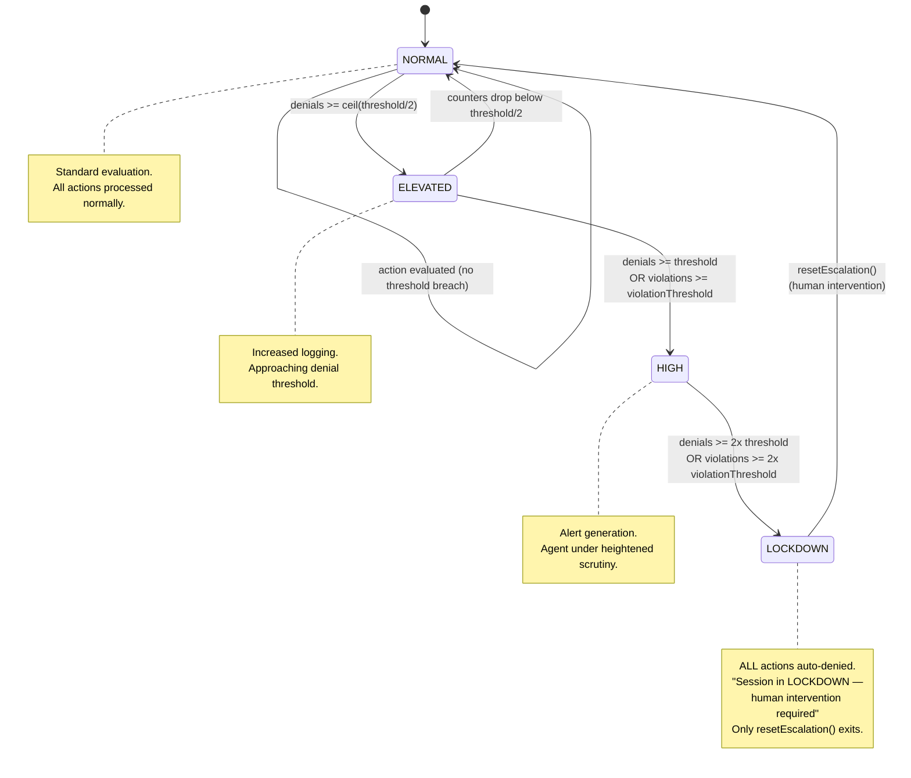

# Escalation Model Diagram

## Four-Level Escalation State Machine



## ASCII Representation

```
                    ESCALATION STATE MACHINE
                    ========================

    ┌────────────────────────────────────────────────┐
    │                                                │
    │  ┌──────────┐                                  │
    │  │  NORMAL  │ ◄─────── resetEscalation()       │
    │  │  (0)     │          (human intervention)    │
    │  └────┬─────┘                    ▲             │
    │       │                          │             │
    │       │ denials >= ⌈threshold/2⌉  │             │
    │       ▼                          │             │
    │  ┌──────────┐                    │             │
    │  │ ELEVATED │                    │             │
    │  │  (1)     │                    │             │
    │  └────┬─────┘                    │             │
    │       │                          │             │
    │       │ denials >= threshold      │             │
    │       │ OR violations >= vThresh  │             │
    │       ▼                          │             │
    │  ┌──────────┐                    │             │
    │  │  HIGH    │                    │             │
    │  │  (2)     │                    │             │
    │  └────┬─────┘                    │             │
    │       │                          │             │
    │       │ denials >= 2×threshold    │             │
    │       │ OR violations >= 2×vThr   │             │
    │       ▼                          │             │
    │  ┌──────────┐                    │             │
    │  │ LOCKDOWN │ ───────────────────┘             │
    │  │  (3)     │                                  │
    │  └──────────┘                                  │
    │                                                │
    └────────────────────────────────────────────────┘


    DEFAULT THRESHOLDS
    ┌─────────────────────────────────────────────┐
    │  denialThreshold:    5                      │
    │  violationThreshold: 3                      │
    │  windowSize:         10 (recent denials)    │
    └─────────────────────────────────────────────┘

    ESCALATION TRIGGERS (with defaults)
    ┌─────────────────────────────────────────────┐
    │  NORMAL → ELEVATED:  denials >= 3           │
    │  ELEVATED → HIGH:    denials >= 5           │
    │                      OR violations >= 3     │
    │  HIGH → LOCKDOWN:    denials >= 10          │
    │                      OR violations >= 6     │
    └─────────────────────────────────────────────┘

    LOCKDOWN BEHAVIOR
    ┌─────────────────────────────────────────────┐
    │  • All actions auto-denied                  │
    │  • Reason: "Session in LOCKDOWN —           │
    │    human intervention required"             │
    │  • Severity: 5 (maximum)                    │
    │  • Intervention: DENY                       │
    │  • Only exit: resetEscalation()             │
    │    (clears all counters and maps)           │
    └─────────────────────────────────────────────┘


    MONITOR STATISTICS (tracked per session)
    ┌─────────────────────────────────────────────┐
    │  totalEvaluations:      number              │
    │  totalDenials:          number              │
    │  totalViolations:       number              │
    │  denialsByAgent:        Map<agent, count>   │
    │  violationsByInvariant: Map<id, count>      │
    │  recentDenials:         RecentDenial[]      │
    │  uptime:                milliseconds        │
    └─────────────────────────────────────────────┘
```

## Example Progression (10 Actions)

```
Action  Denials  Violations  Level       Notes
──────  ───────  ──────────  ──────────  ──────────────────────
  1       1        0         NORMAL      Below threshold/2
  2       2        1         NORMAL      Still below
  3       3        1         ELEVATED    denials >= ⌈5/2⌉ = 3
  4       4        2         ELEVATED    Still below threshold
  5       5        2         HIGH        denials >= 5
  6       6        3         HIGH        violations hit 3 too
  7       7        3         HIGH        Both thresholds met
  8       8        4         HIGH        Approaching 2x
  9       9        5         HIGH        Close to lockdown
 10      10        6         LOCKDOWN    denials >= 2×5 = 10
 11       -        -         LOCKDOWN    Auto-denied, no eval
```

## Source References

- `ESCALATION` levels: `src/kernel/monitor.ts`
- `updateEscalation()`: `src/kernel/monitor.ts`
- `process()` with lockdown check: `src/kernel/monitor.ts`
- `resetEscalation()`: `src/kernel/monitor.ts`
- `getStatus()`: `src/kernel/monitor.ts`
