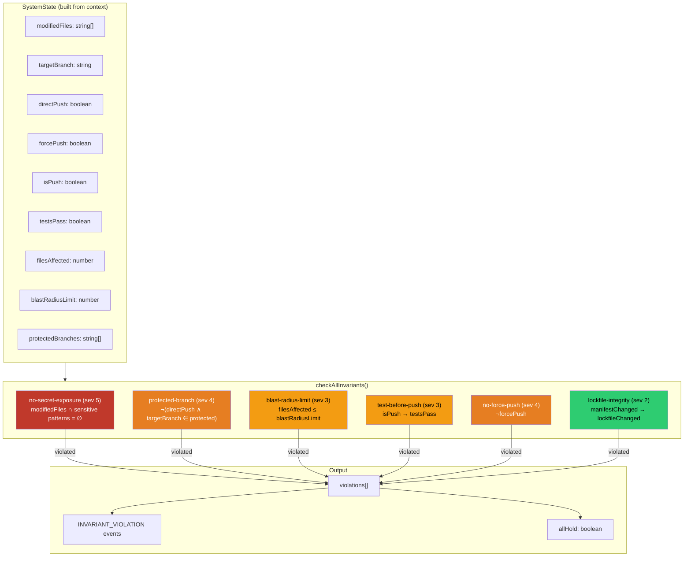

# Invariant Enforcement Diagram

## System Invariants and Checking Flow



## ASCII Representation

```
SYSTEM STATE ────────────────────────────────────
┌───────────────────────────────────────────────┐
│  buildSystemState(context)                    │
│                                               │
│  modifiedFiles:     ["src/auth.ts", ".env"]   │
│  targetBranch:      "main"                    │
│  directPush:        true                      │
│  forcePush:         true                      │
│  isPush:            true                      │
│  testsPass:         undefined                 │
│  filesAffected:     2                         │
│  blastRadiusLimit:  20 (default)              │
│  protectedBranches: ["main", "master"]        │
└───────────────────────┬───────────────────────┘
                        │
                        ▼
checkAllInvariants(DEFAULT_INVARIANTS, state)
┌───────────────────────────────────────────────┐
│                                               │
│  ┌─ no-secret-exposure ──────── severity 5 ─┐ │
│  │ Check: modifiedFiles vs sensitive patterns│ │
│  │ .env, credentials, .pem, .key, secret     │ │
│  │ Result: ✗ VIOLATED (.env detected)        │ │
│  │ → INVARIANT_VIOLATION event               │ │
│  └───────────────────────────────────────────┘ │
│                                               │
│  ┌─ protected-branch ───────── severity 4 ──┐ │
│  │ Check: directPush ∧ branch ∈ protected?  │ │
│  │ Result: ✗ VIOLATED (direct push to main)  │ │
│  │ → INVARIANT_VIOLATION event               │ │
│  └───────────────────────────────────────────┘ │
│                                               │
│  ┌─ blast-radius-limit ─────── severity 3 ──┐ │
│  │ Check: filesAffected ≤ 20?               │ │
│  │ Result: ✓ HOLDS (2 ≤ 20)                 │ │
│  └───────────────────────────────────────────┘ │
│                                               │
│  ┌─ test-before-push ──────── severity 3 ───┐ │
│  │ Check: isPush → testsPass?                │ │
│  │ Result: ✗ VIOLATED (tests not verified)   │ │
│  │ → INVARIANT_VIOLATION event               │ │
│  └───────────────────────────────────────────┘ │
│                                               │
│  ┌─ no-force-push ─────────── severity 4 ───┐ │
│  │ Check: ¬forcePush?                        │ │
│  │ Result: ✗ VIOLATED (force push detected)  │ │
│  │ → INVARIANT_VIOLATION event               │ │
│  └───────────────────────────────────────────┘ │
│                                               │
│  ┌─ lockfile-integrity ────── severity 2 ───┐ │
│  │ Check: manifestChanged → lockfileChanged? │ │
│  │ Result: ✓ HOLDS (no manifest changes)     │ │
│  └───────────────────────────────────────────┘ │
│                                               │
└───────────────────────┬───────────────────────┘
                        │
                        ▼
OUTPUT ──────────────────────────────────────────
┌───────────────────────────────────────────────┐
│  violations: [                                │
│    { invariant: no-secret-exposure, sev: 5 }, │
│    { invariant: protected-branch,   sev: 4 }, │
│    { invariant: test-before-push,   sev: 3 }, │
│    { invariant: no-force-push,      sev: 4 }  │
│  ]                                            │
│  events: [4 INVARIANT_VIOLATION events]       │
│  allHold: false                               │
│  maxSeverity: 5 → intervention: DENY          │
└───────────────────────────────────────────────┘
```

## Source References

- `SystemState`: `src/invariants/definitions.ts`
- `DEFAULT_INVARIANTS`: `src/invariants/definitions.ts`
- `buildSystemState()`: `src/invariants/checker.ts`
- `checkAllInvariants()`: `src/invariants/checker.ts`
- `selectIntervention()`: `src/kernel/decision.ts`
