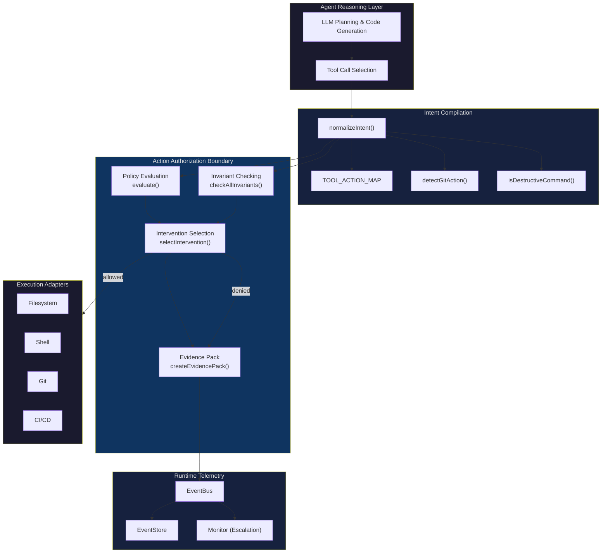

# System Architecture Diagram

## Four-Layer Execution Governance Model



## ASCII Representation

```
┌─────────────────────────────────────────────┐
│          Agent Reasoning Layer               │
│  ┌──────────────┐  ┌─────────────────────┐  │
│  │ LLM Planning │──│ Tool Call Selection  │  │
│  └──────────────┘  └─────────┬───────────┘  │
└──────────────────────────────┼───────────────┘
                               │ raw tool call
                               ▼
┌─────────────────────────────────────────────┐
│          Intent Compilation                  │
│                                             │
│  normalizeIntent(rawAction)                 │
│    ├── TOOL_ACTION_MAP: tool → action type  │
│    ├── detectGitAction(): regex → git.*     │
│    └── isDestructiveCommand(): 11 patterns  │
│                                             │
│  Output: NormalizedIntent                   │
│    { action, target, agent, destructive }   │
└──────────────────────┬──────────────────────┘
                       │ NormalizedIntent
                       ▼
┌─────────────────────────────────────────────┐
│     Action Authorization Boundary (AAB)      │
│                                             │
│  1. evaluate(intent, policies)              │
│     ├── deny rules checked first            │
│     └── allow rules checked second          │
│                                             │
│  2. checkAllInvariants(invariants, state)    │
│     └── 6 default invariants                │
│                                             │
│  3. selectIntervention(maxSeverity)          │
│     ├── ≥5: DENY                            │
│     ├── ≥4: PAUSE                           │
│     ├── ≥3: ROLLBACK                        │
│     └── <3: TEST_ONLY                       │
│                                             │
│  4. createEvidencePack(intent, decision,     │
│     violations, events)                     │
└────────┬────────────────────────┬───────────┘
         │ allowed                │ denied
         ▼                       ▼
┌─────────────────┐  ┌───────────────────────┐
│ Execution       │  │ Runtime Telemetry      │
│ Adapters        │  │                       │
│ ├── Filesystem  │  │ EventBus → EventStore │
│ ├── Shell       │  │ Monitor (Escalation)  │
│ ├── Git         │  │ Evidence Packs        │
│ └── CI/CD       │  └───────────────────────┘
└─────────────────┘
```

## Source References

- Intent Compilation: `src/kernel/aab.ts`
- AAB Authorization: `src/kernel/aab.ts`
- Engine Evaluation: `src/kernel/decision.ts`
- Intervention Selection: `src/kernel/decision.ts`
- Evidence Packs: `src/kernel/evidence.ts`
- Monitor: `src/kernel/monitor.ts`
